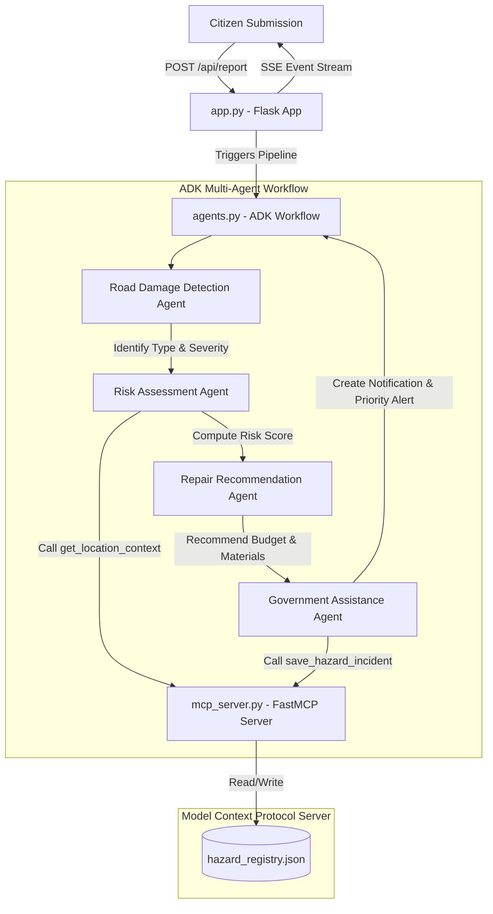

# RoadGuard AI 🚧🤖
### Citizen-Powered Road Infrastructure Intelligence Agent
**Kaggle AI Agents: Intensive Vibe Coding Capstone Project (Agents for Good Track)**

RoadGuard AI is an advanced, multi-agent infrastructure monitoring and risk intelligence system designed to automate public works reporting and repair dispatching. By empowering citizens with an intuitive dashboard and using specialized agent workflows, RoadGuard AI bridges the gap between community-reported hazards and public works response efficiency.

---

## 🛠️ Tech Stack & Core Architecture

* **Orchestrator Framework**: Google Agent Development Kit (ADK 2.3) managing a sequential graph-based routing system.
* **Runtime & Sandbox**: Antigravity local vibe coding execution environment.
* **Database & Tool Gateway**: Managed via a decoupled **Model Context Protocol (MCP)** Server communicating over `stdio` transport.
* **Web Interface**: Lightweight Flask application with a modern, glassmorphic dark-mode CSS design system and real-time Server-Sent Events (SSE) streaming.
* **AI Engine**: Gemini API (`gemini-2.5-flash`) for multi-step reasoning and tool execution.



---

## 💡 Demonstrated Course Concepts

### 1. Multi-Agent System (ADK)
Defined inside [agents.py](agents.py) using the Google ADK `Workflow` class. The orchestrator routes the conversation through four specialized `LlmAgent` nodes:
* **Road Damage Detection Agent**: Parses report descriptions to classify damage type and severity.
* **Risk Assessment Agent**: Uses MCP tools to query location context and computes a 0-100 hazard risk score.
* **Repair Recommendation Agent**: Recommends appropriate materials, hours, and budgets.
* **Government Assistance Agent**: Synthesizes a public works alert, determines priority levels, and saves the verified record to the registry.

### 2. Model Context Protocol (MCP)
Implemented in [mcp_server.py](mcp_server.py) using `FastMCP`. Exposes tools:
* `get_location_context(lat, lng)`: Simulates traffic density and school zone proximity context.
* `save_hazard_incident(payload)`: Safely registers incidents into `hazard_registry.json`.
* `get_hazard_registry()`: Pulls all registered incidents.
The ADK agents dynamically connect to the server over stdio using `StdioConnectionParams` and `StdioServerParameters` client wrappers.

### 3. Antigravity Environment
Developed and tested within the local sandbox environment, ensuring cross-environment compatibility and sandboxed safety.

### 4. Security Features
Strict adherence to security guidelines:
* **No hardcoded credentials**: The system dynamically reads `GEMINI_API_KEY` from `os.environ`.
* **Subprocess Isolation**: MCP tool execution is restricted to the isolated subprocess level.

### 5. Deployability
* Designed with modular components.
* The Flask server manages the entire static client frontend and dynamically spawns the MCP process, allowing for single-command deployments (e.g. Docker, Heroku, or VM).

### 6. Agent Skills & CLI
The agent system is built to support interactive CLI mode. You can run manual tests using:
```bash
python agents.py
```

---

## 🚀 Setup & Run Instructions

### Prerequisites
* Python 3.10+
* Google Gemini API Key

### 1. Clone & Install Dependencies
Navigate to the directory and install dependencies:
```bash
pip install -r requirements.txt
```

### 2. Configure Environment Variables
Set your Gemini API key in your terminal context:
* **Windows PowerShell**:
  ```powershell
  $env:GEMINI_API_KEY="your_api_key_here"
  ```
* **Windows CMD**:
  ```cmd
  set GEMINI_API_KEY=your_api_key_here
  ```
* **macOS/Linux**:
  ```bash
  export GEMINI_API_KEY="your_api_key_here"
  ```

### 3. Start the Web Server
Launch the Flask application:
```bash
python app.py
```

### 4. Access the App
Open your browser and navigate to:
👉 **[http://127.0.0.1:5000](http://127.0.0.1:5000)**

---

## 🧪 Testing Mock Scenarios
The citizen portal has built-in **Quick Test Scenarios** for rapid evaluation:
1. **School Zone Pothole**: Simulates high-priority hazard next to a school.
2. **Highway Debris**: Simulates medium-priority lane blockage.
3. **Residential Crack**: Simulates low-priority erosion.

When you submit:
1. The **timeline tracer** highlights the active agent node.
2. The agent outputs are streamed live onto the screen.
3. The new incident appears instantly in the Registry grid at the bottom.
