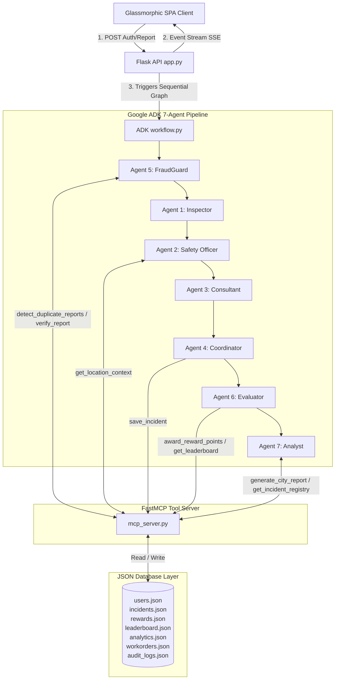

# CivicGuard AI 🚧🤖
### Citizen-Powered Infrastructure Intelligence Platform
**Kaggle AI Agents: Intensive Vibe Coding Capstone Project (Agents for Good Track)**

CivicGuard AI is a complete, production-quality, multi-agent civic intelligence platform. It enables citizens to collaboratively report public infrastructure issues, while a team of 7 specialized AI agents analyzes, verifies, prioritizes, recommends repairs, generates work orders, updates analytics, and awards civic participation points.

**Primary Module:** RoadGuard AI (Fully Implemented)
**Secondary Modules (In Progress Ecosystem):** WaterGuard AI, EnvironmentGuard AI, CleanCity AI, PublicAssetGuard AI.

---

## 📖 Table of Contents
1. [System Architecture Diagrams](#-system-architecture-diagrams)
2. [Database Schema & Registry Models](#-database-schema--registry-models)
3. [Model Context Protocol (MCP) Tool Specifications](#-model-context-protocol-mcp-tool-specifications)
4. [ADK Multi-Agent Team Layout](#-adk-multi-agent-team-layout)
5. [API Documentation](#-api-documentation)
6. [Security & FraudGuard Features](#-security--fraudguard-features)
7. [Installation & Setup Guides](#-installation--setup-guides)
8. [Video Demo Script & Walkthrough](#-video-demo-script--walkthrough)
9. [Troubleshooting & Diagnostics](#-troubleshooting--diagnostics)
10. [Hackathon Submission Summary](#-hackathon-submission-summary)

---

## 🏗️ System Architecture Diagrams

### 1. System Topology
The platform consists of a single-page glassmorphism frontend client communicating with a Flask API backend. Real-time updates are streamed via Server-Sent Events (SSE). The Flask process acts as an orchestrator, executing a Google ADK graph workflow. Database operations and location metadata checks are decoupled behind a dedicated Model Context Protocol (MCP) Server.



---

## 🗄️ Database Schema & Registry Models

The MVP uses structured local JSON databases, which are structured with full type schemas to simplify future migrations to MongoDB or PostgreSQL.

### 1. User Profiles Registry (`users.json`)
```json
[
  {
    "username": "string (unique ID)",
    "password": "string (SHA-256 hashed)",
    "fullname": "string (display name)",
    "role": "string (citizen | government | admin)",
    "points": "integer (reputation balance)",
    "badges": ["string (e.g. 'Road Protector')"],
    "status": "string (active | restricted | suspended)",
    "created_at": "string (ISO timestamp)"
  }
]
```

### 2. Hazard Incident Registry (`incidents.json`)
```json
[
  {
    "incident_id": "string (Format: HZ-RG-XXXXX)",
    "username": "string (reporter)",
    "description": "string",
    "latitude": "float",
    "longitude": "float",
    "image_url": "string (nullable)",
    "status": "string (Open | Scheduled | In Progress | Resolved)",
    "created_at": "string (ISO timestamp)",
    "fraud_guard": {
      "trust_score": "float (0.0 to 100.0)",
      "fraud_score": "float (0.0 to 100.0)",
      "status": "string (Passed | Flagged)",
      "reasoning": "string"
    },
    "detection": {
      "damage_type": "string",
      "severity": "string (Low | Medium | High | Critical)",
      "confidence": "float (0.0 to 1.0)",
      "summary": "string"
    },
    "risk": {
      "risk_score": "float (0.0 to 100.0)",
      "priority": "string (Low | Medium | High | Critical)",
      "explanation": "string"
    },
    "repair": {
      "materials": ["string"],
      "labor": "string",
      "budget": "float (USD)",
      "timeline": "string",
      "recommendation": "string"
    },
    "government": {
      "assigned_department": "string",
      "work_order_id": "string",
      "summary": "string"
    },
    "rewards": {
      "points_awarded": "integer",
      "badge_earned": "string (nullable)",
      "level": "string"
    },
    "intelligence": {
      "hotspot_updated": "boolean",
      "regional_forecast": "string"
    }
  }
]
```

### 3. Work Orders Registry (`workorders.json`)
```json
[
  {
    "work_order_id": "string (Format: WO-RG-XXXXX)",
    "incident_id": "string (HZ-RG-XXXXX)",
    "assigned_department": "string",
    "priority": "string",
    "status": "string (Assigned | In Progress | Completed)",
    "materials": ["string"],
    "budget": "float",
    "labor_hours": "float",
    "scheduled_start": "string (ISO timestamp)",
    "created_at": "string (ISO timestamp)"
  }
]
```

---

## 🔌 Model Context Protocol (MCP) Tool Specifications

The dedicated FastMCP server (`mcp_server.py`) exposes **9 structural tools** to give agents access to location data, duplicate detection, rewards processing, and validation:

1.  `get_location_context(lat: float, lng: float) -> dict`: Simulates geofenced queries to return traffic volumes, proximity to schools or hospitals, speed limits, and road classes.
2.  `save_incident(payload: dict) -> str`: Safely registers a verified incident in `incidents.json`, spawns a work order in `workorders.json`, and updates hotspot density logs.
3.  `get_incident_registry() -> list`: Returns all incidents.
4.  `award_reward_points(username: str, points: int, severity: str, incident_id: str) -> dict`: Dynamically records points, appends reward transactions, and reviews badge tier triggers.
5.  `get_leaderboard() -> list`: Fetches ranks sorted by accumulated citizen points.
6.  `detect_duplicate_reports(lat: float, lng: float, description: str) -> dict`: Performs Haversine distance checks (~150m radius) and description keyword comparisons to prevent duplicate submissions.
7.  `generate_city_report(city: str) -> dict`: Computes aggregate data for Chennai or San Francisco.
8.  `get_user_contribution_history(username: str) -> dict`: Returns points, badges list, and submitted reports.
9.  `verify_report(payload: dict) -> dict`: Checks description lengths and coordinates limits. Detects simulated AI watermark metadata in submitted images.

---

## 🤖 ADK Multi-Agent Team Layout

All agents are declared as `LlmAgent` instances within [agents.py](agents.py) and execute sequentially:

1.  **Agent 5: FraudGuard Agent (Trust & Safety Officer)**
    *   **Goal:** Identifies duplicate reports and AI image manipulations.
    *   **Tools:** `detect_duplicate_reports`, `verify_report`.
2.  **Agent 1: Infrastructure Detection Agent (AI Inspector)**
    *   **Goal:** Classifies damage type and severity, outputs confidence parameters.
3.  **Agent 2: Risk Assessment Agent (Public Safety Officer)**
    *   **Goal:** Computes hazard risk score (0-100) and Priority Level.
    *   **Tools:** `get_location_context`.
4.  **Agent 3: Repair Recommendation Agent (Civil Engineering Consultant)**
    *   **Goal:** Estimates budgets, materials aggregate mixes, labor hours, and repair steps.
5.  **Agent 4: Government Assistance Agent (Public Works Coordinator)**
    *   **Goal:** Synthesizes repair profiles into municipal work orders.
    *   **Tools:** `save_incident`.
6.  **Agent 6: Civic Rewards Agent (Contribution Evaluator)**
    *   **Goal:** Computes and awards reputation scores based on hazard severity.
    *   **Tools:** `award_reward_points`.
7.  **Agent 7: Infrastructure Intelligence Agent (National Analyst)**
    *   **Goal:** Updates hotspot indexes and forecasts structural risks.
    *   **Tools:** `generate_city_report`.

---

## 📋 API Documentation

### Authentication Endpoints
-   `POST /api/auth/register`: Create a new citizen account.
    *   Input: `{"username": "...", "password": "...", "fullname": "..."}`
-   `POST /api/auth/login`: Authenticate credentials, return a signed JWT-like token.
    *   Input: `{"username": "...", "password": "..."}`
    *   Output: `{"token": "...", "username": "...", "role": "citizen | government | admin"}`

### Incident Endpoints
-   `GET /api/incidents`: Fetch all reported incidents in reverse chronological order.
-   `POST /api/incidents/update`: Update hazard patch status (Requires **government** or **admin** roles).
    *   Input: `{"incident_id": "HZ-RG-XXXXX", "status": "In Progress | Resolved"}`
-   `GET /api/report` (SSE Stream): Start the 7-agent pipeline.
    *   Input (Query Params): `description`, `latitude`, `longitude`, `image_url`
    *   Headers: `Authorization: Bearer <token>`

### Analytics & Rewards Endpoints
-   `GET /api/leaderboard`: Fetch top citizen rankings.
-   `GET /api/rewards`: Fetch reward transactions.
-   `GET /api/analytics`: Fetch aggregated city-wide metrics.
-   `POST /api/city-report`: Query direct markdown city report from the Analyst agent.
    *   Input: `{"city": "Chennai | San Francisco"}`

---

## 🛡️ Security & FraudGuard Features

-   **Environment Separation:** Reads `GEMINI_API_KEY` from the OS shell. No secrets are hardcoded.
-   **JWT Signed Tokens:** Base64 encoded payload with a signed SHA-256 HMAC signature prevents session spoofing.
-   **Input Validation:** Pydantic models validate data ranges (e.g. coordinates within \[-90, 90\], description length).
-   **Geospatial Anti-Spam:** Proximity scanner locks submissions within 150m of active hazards.
-   **Audit Logging:** Logs user logins, registrations, status updates, and security flags in `audit_logs.json`.
-   **Penalty Enforcer:** Suspends user profiles matching AI fake images or restricts spam reporters from using endpoints.

---

## 🚀 Installation & Setup Guides

### Local Setup Instructions

1.  **Prerequisites:** Python 3.10+ and a Gemini API Key.
2.  **Install dependencies:**
    ```bash
    pip install -r requirements.txt
    ```
3.  **Seed Database files:**
    ```bash
    python seed_db.py
    ```
4.  **Set your Gemini API Key:**
    *   **Windows Powershell:** `$env:GEMINI_API_KEY="AIzaSy..."`
    *   **Windows CMD:** `set GEMINI_API_KEY=AIzaSy...`
    *   **Linux/macOS:** `export GEMINI_API_KEY="AIzaSy..."`
5.  **Run the Flask application:**
    ```bash
    python app.py
    ```
6.  **Access Dashboard:** Open your browser to `http://127.0.0.1:5000`

---

### Docker & Containerization Setup

1.  **Build image locally:**
    ```bash
    docker build -t civicguard-ai .
    ```
2.  **Run container:**
    ```bash
    docker run -p 5000:5000 -e GEMINI_API_KEY="your_key" civicguard-ai
    ```
3.  **Using Docker Compose:**
    Ensure you have `GEMINI_API_KEY` configured in your shell environment, then launch:
    ```bash
    docker-compose up --build
    ```

---

### Cloud Run Deployment Guide

1.  **Install Google Cloud SDK** and configure your GCP project.
2.  **Build and Push the Container to Google Artifact Registry:**
    ```bash
    gcloud auth configure-docker us-central1-docker.pkg.dev
    docker build -t us-central1-docker.pkg.dev/[PROJECT_ID]/roadguard-repo/civicguard-ai:v1 .
    docker push us-central1-docker.pkg.dev/[PROJECT_ID]/roadguard-repo/civicguard-ai:v1
    ```
3.  **Deploy to Cloud Run:**
    ```bash
    gcloud run deploy civicguard-service \
      --image=us-central1-docker.pkg.dev/[PROJECT_ID]/roadguard-repo/civicguard-ai:v1 \
      --platform=managed \
      --region=us-central1 \
      --allow-unauthenticated \
      --set-env-vars=GEMINI_API_KEY="your_api_key"
    ```

---

## 📽️ Video Demo Script & Walkthrough
**Target Duration:** 4:50 Minutes

### Part 1: The Vision & Architecture (0:00 - 1:15)
-   **Visual:** Show the Landing Page, hovering over statistics cards and the System Architecture diagram.
-   **Audio:** *"Welcome to CivicGuard AI, a citizen-powered platform for infrastructure intelligence. Public works face delays due to manual tracking, fake reports, and slow repair planning. CivicGuard uses a sequential team of 7 Google ADK agents and custom MCP tools to solve this."*

### Part 2: Filing a Report & Real-time Observation (1:15 - 2:30)
-   **Visual:** Navigate to **File a Report**. Select the "School Zone Pothole" scenario. Click "Launch Pipeline". The app shifts to the **Agent Monitor** dashboard.
-   **Audio:** *"Here we report a pothole in Chennai. When submitted, Server-Sent Events stream live outputs. First, FraudGuard checks for duplicates within 150 meters and analyzes the image. Next, our Inspector classifies the pothole. The Safety Officer queries location context, identifying that it is in a school zone, which raises the risk score to 90/100."*

### Part 3: Recommendations, Work Orders & Rewards (2:30 - 3:30)
-   **Visual:** Stream shows Repair Consultant proposing base aggregates, followed by Coordinator writing a public works registry record. Next, Evaluator awards 100 points, unlocking a "National Contributor" badge.
-   **Audio:** *"Our Consultant estimates material requirements and a $450 budget. The Coordinator creates a work order, assigning the Chennai Corporation Road Maintenance. The Rewards Agent awards 100 points to Lokesh for a critical hazard report, updating his badge rank."*

### Part 4: Government & Analytics Portals (3:30 - 4:15)
-   **Visual:** Switch demo role to **Gov Officer**. Open the **Government Portal**, select the new incident, and dispatch a repair crew (changing status to "In Progress"). Switch to **Analytics** and query Chennai's Intelligence report.
-   **Audio:** *"Government authorities see the new incident and dispatch repair crews. On the analytics tab, we can run direct Analyst queries, generating custom markdown risk forecasts for the city."*

### Part 5: Security Audits & Future Modules (4:15 - 4:50)
-   **Visual:** Switch role to **Admin**. Open the **Admin Panel** to view the Security logs database, showing previous IP blocks. Open the **Future Scope** tab.
-   **Audio:** *"The Admin panel logs events like registrations, logins, and duplicate alerts. CivicGuard is ready to scale into WaterGuard, CleanCity, and EnvironmentGuard modules. Thank you."*

---

## 🔧 Troubleshooting & Diagnostics

-   **Unicode Error in Windows:**
    If you see a `UnicodeEncodeError` in your console logs during `seed_db.py`, make sure python logs are printed in plain ASCII text.
-   **Gemini API Key missing:**
    If the workflow outputs `Pipeline Exception: API Key not set`, verify that the `GEMINI_API_KEY` is present in the shell process calling `python app.py`.
-   **MCP Server Process Spawning:**
    The ADK client spawns `mcp_server.py` in a separate python process over stdio. If you experience connection timeouts:
    -   Ensure `mcp` package is installed (`pip install mcp`).
    -   Verify that you can run `python mcp_server.py` independently without library errors.

---

## 🏆 Hackathon Submission Summary

-   **ADK Graph Workflows:** Implemented in `agents.py` with 7 LLM-based agents sharing conversational context.
-   **Decoupled Database & Tools:** Exposes 9 distinct FastMCP tools in `mcp_server.py`.
-   **Observability:** Leverages a custom HTML timeline streaming SSE updates.
-   **Security Layer:** Integrated JWT auth, inputs validation (Pydantic), geospatial anti-spams, and security audit logging.
